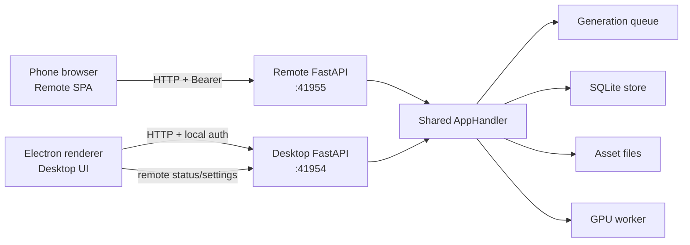

# LAN Remote Explore

LAN Remote lets a phone or another computer use LTX Desktop Explore over the
same local network. The remote client uses the same generation queue, SQLite
store, assets, and GPU worker as Desktop Explore. It does not create a second
generation pipeline.

## Architecture



The two HTTP servers use different ports:

| Surface | Purpose |
| --- | --- |
| `:41954` | Full Desktop backend and Desktop-only controls |
| `:41955` | Authenticated, allowlisted phone surface |
| `:41954/api/remote/status` | Desktop control-plane status for the Remote server |

The phone opens a dedicated pairing route. The one-time grant lives in the
query string so QR scanners and macOS/`open` / Electron `openExternal` keep
it (fragments are often dropped before JavaScript runs):

```text
http://<lan-address>:41955/pairing?t=<one-time-grant>
```

The Remote server disables uvicorn access logs. `origin_url()` strips query
and fragment before our own logs. The document sends `no-referrer`. The grant
is one-time and lasts ~5 minutes; after a successful pair the SPA `replace`s
to `/`.

`/api/remote/status` is not the phone API. It tells Desktop whether the
separate Remote server is permitted, starting, serving, or failed. Desktop
also lists and revokes paired devices on `:41954`:

- `GET /api/remote/devices`
- `POST /api/remote/devices/{device_id}/revoke`

## Remote API boundary

The Remote server exposes only the Explore surface:

- `GET /health` — public liveness check.
- `POST /api/pairing/exchange` — public; trades the one-time grant for a
  durable device session.
- `GET /api/session` — authenticated pairing check.
- T2V/I2V generation list, create, get, retry, cancel, and delete.
- `GET /api/generate/models-specs`.
- `POST /api/assets/upload` — image input upload.
- `GET /api/assets/{id}` — path-free asset metadata plus signed media URLs.
- `GET`/`HEAD /api/assets/{id}/bytes` — media playback via a short-lived
  HMAC-signed URL (`bytes_url` on the asset DTO).
- `GET`/`HEAD /api/assets/{id}/thumbnail/bytes` — same, via `thumbnail_url`.
- `GET /api/prompt-enhancer` — whether Gemini and/or local Enhance are
  available, plus `defaultProvider` (Gemini if a Desktop key is stored,
  otherwise local Gemma when downloaded). Does not return API keys or
  filesystem paths.
- `POST /api/enhance-prompt` — rewrite the prompt. Image frames are asset ids,
  never paths. Body `provider` is `local` or `api`; omit it to use
  `defaultProvider`. Explicit `api` without a key returns
  `GEMINI_API_KEY_MISSING` (no silent fallback to Gemma). The Enhance button
  follows the Desktop Auto-Enhance setting (hidden when auto-enhance is on).
- `GET`/`PATCH /api/feature-flags` — the dev feature flags shared with Desktop
  (`feature_flags.json`). The Dev Panel opens in the Remote with Ctrl+Shift+D
  or `?devpanel=1`, so any paired device can change them.
- Bundled Remote SPA assets.

These stay off `:41955`:

- Settings and shutdown.
- Desktop path ingest (`POST /api/assets`).
- Model downloads and Hugging Face auth (except the LoRA recipe preflight
  already on this port).
- Image generation, IC-LoRA, Extend, and Retake.

The separate port is the namespace boundary. Therefore the phone uses normal
paths such as `/api/generations`; adding `/api/remote/` to every phone route
would add special cases without adding security.

## Pairing and authentication

There are no cookies. Cookies would break when the SPA origin later becomes
`connect.ltx.io` while the API stays on the engine host.

The Desktop controller mints a one-time grant (5 minutes, single use) and puts
it in the QR query (`/pairing?t=`). The phone:

1. Lands on `/pairing` (Explore chrome is not mounted). It uses that token to
   `POST /api/pairing/exchange`. If the phone already has a stored session, it
   sends `Authorization: Bearer <device-session>` so the host reuses that row
   instead of inserting another device.
2. Stores the returned device session in memory and `localStorage`.
3. `replace`s to `/`, dropping `t`. A failed pair stays on `/pairing?t=` so a
   reload can retry.

A new phone, or a phone that cleared storage / was revoked, still inserts a
row. Two different phones stay two rows. Scanning a **new** QR from an
already-paired phone keeps one row, the same session token, and the same
`device_id`. Retrying a consumed grant fails and does not unpair the phone.

The session survives reloads and Remote restarts; turning Remote off does not
revoke devices. API calls use `Authorization: Bearer <device-session>`. Media
uses host-minted `bytes_url` / `thumbnail_url` values. Those URLs are
HMAC-signed, asset-scoped, and expiry-bucketed to 5-minute windows so
generation polling does not rewrite `<video src>` every 2 seconds. Each URL
stays valid for at least one full bucket (never a leftover 1s slice). The
signature does not bind HTTP method, so GET, HEAD, and Range 206 share one
URL. Expired or tampered media returns **403**, not 401, so a stale media URL
does not clear the session.

Failed exchanges are rate-limited (8 failures / 60 seconds → 429). After a
successful pair the grant rotates. A 401 on an API call clears stored session.

Desktop Settings can list paired devices and revoke one. Revoke is the only
way to drop a durable session; restarting Remote does not unpair anyone.

`apiBase()` is `globalThis.__LTX_REMOTE_API_BASE__` when set, otherwise same
origin. That seam is for a later Connect host; LAN leaves it empty.

The Remote document uses `no-referrer` to reduce accidental URL propagation.

## Host-bound Explore runtime

Feature screens are shared. Host-specific behavior is supplied by
`ExploreRuntime`:

| Capability | Desktop | Remote |
| --- | --- | --- |
| API client | Electron backend credentials | Same-origin Bearer client |
| Media input | Native file dialog/path ingest | Browser file picker/multipart upload |
| Media playback | `file://` asset path | Host-signed `bytes_url` |
| Finder reveal | Available | Not available |
| Packaged seeds | Path ingest via `loadPackagedAsset` | Catalog fetch + upload via `loadPackagedAsset` |
| Active-generation polling | 1 second | 2 seconds with error backoff |

Shared Feature/Home code must not call `window.electronAPI` directly. Electron
behavior belongs in Desktop runtime adapters. ESLint enforces this boundary for
shared Home, Explore, and Remote surfaces.

## Safe Remote data

Desktop and Remote do not share the same response DTOs.

Remote assets omit filesystem fields:

```json
{
  "id": "asset-id",
  "media_kind": "image",
  "origin": "uploaded",
  "mime_type": "image/png",
  "name": "frame.png",
  "metadata": { "mediaType": "image", "metadata": { "width": 512, "height": 512 } },
  "bytes_url": "/api/assets/asset-id/bytes?exp=...&did=...&sig=...",
  "thumbnail_url": null
}
```

Remote generations expose only the fields needed by Explore:

- Generation identity and lifecycle status.
- Prompt, model, resolution, duration, FPS, and aspect ratio.
- Input asset IDs.
- Output asset metadata and IDs.

Arbitrary stored spec fields, LoRA references, `imagePath`, `path`, and
`thumbnail_path` are not returned. The DTO projection is the primary boundary;
JSON redaction remains defense in depth.

## Feature registration

`frontend/lib/home-features.ts` owns Home presentation metadata.
`frontend/lib/home-feature-registry.ts` is the exhaustive route/host registry.

Every feature must declare:

- One shared `screen`.
- `remote: true`, or `remote: false` when intentionally Desktop-only.

The backend Remote generation router has its own fail-closed allowlist. A new
feature is not remotely available just because a Desktop route exists.

### Adding a feature

1. Add Home metadata and section configuration.
2. Add the exhaustive feature-registry entry.
3. Set `remote: true`, or `remote: false` for Desktop-only.
4. Add the backend Remote allowlist entry only when the phone flow is ready.
5. Add a safe Remote spec projection if the feature stores new fields.
6. Add Desktop/Remote integration tests.
7. Run the project verification commands.

## Lifecycle and limits

- Remote keep-awake is active only while Remote is permitted and starting or
  serving, and only while the computer is on AC power.
- Controller shutdown marks the server as stopping, releases its lock before
  joining the server thread, and clears only the matching server instance.
- Remote image uploads use the existing LTX image suffix, size, and dimension
  limits. Video/audio uploads are not Remote input capabilities; stored
  generated video/audio remains playable through byte endpoints.
- Desktop and Remote FastAPI apps own their handler/controller instances.

## Non-goals

- Cookie sessions (Bearer + signed media URLs only).
- Public internet tunneling / Connect relay (PAKE/TLS is out of scope).
- Treating “same Wi-Fi” as a packet-level security guarantee.
- Desktop filesystem access from the phone.
- A second generation queue or model pipeline.
